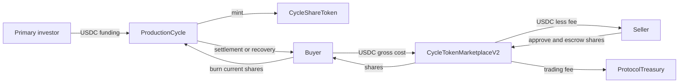
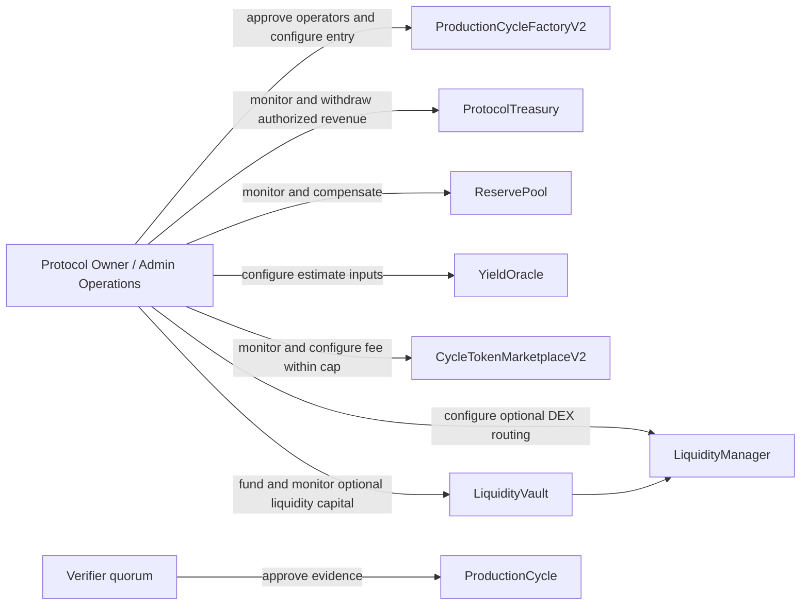

# Architecture

TradeCycle is a set of Arc Testnet contracts and a Next.js frontend for milestone-controlled USDC working capital, transferable cycle-share positions, verifier quorum, settlement, recovery, and operator history.

## System boundaries

- **ProductionCycleFactoryV2** manages operator-entry policy and creates cycle contracts.
- **ProductionCycle** holds primary funding, enforces lifecycle state, releases approved milestones, accepts repayment, and processes current-holder redemption.
- **CycleShareToken** is a transferable ERC-20 position minted by its cycle and burned during settlement or recovery.
- **VerifierRegistry** manages verifier stake, evidence approvals, and quorum.
- **CollateralVault** holds operator collateral.
- **ReservePool** provides exceptional authorized recovery support.
- **ProtocolTreasury** receives protocol and marketplace fees and exposes owner-authorized treasury operations.
- **YieldOracle** exposes optional owner-controlled estimate and risk inputs; it does not rewrite immutable cycle terms.
- **CycleTokenMarketplaceV2** is the implemented escrowed USDC sell-order mechanism.
- **LiquidityManager** and **LiquidityVault** are separately gated advanced DEX infrastructure and are not required for order-book trading.
- **Next.js frontend** provides public, wallet, operator, verifier, marketplace, portfolio, Credit Passport, and owner-gated Admin surfaces.

## Primary funding and cycle state

A factory-created ProductionCycle deploys its own CycleShareToken. During FUNDING, investor USDC transfers into the cycle and the cycle mints an equivalent share quantity. The cycle advances through FUNDING, ACTIVE, HARVEST_SUBMITTED, DISTRIBUTED, or DEFAULTED. Operators submit evidence, while VerifierRegistry quorum controls milestone approval before release.

Repayment is accepted only under the cycle's settlement rules. Distribution computes a per-share entitlement. Redemption reads the caller's current token balance, burns those shares, and transfers the corresponding settlement. Default recovery follows the same current-holder principle.

## Transferable positions and secondary liquidity

Marketplace orders can be partially or fully filled. Cancellation returns the remaining escrow. The seller's ask is not an oracle price, fair value, or guaranteed return. Liquidity depends on active listings and counterparties.

The current frontend disables new buy and list actions after distribution or default and directs holders to Portfolio, while preserving cancellation. This is a frontend lifecycle policy: the deployed marketplace does not query cycle state and existing orders are not automatically closed by settlement.

## Protocol administration

Owner permissions do not imply direct control of cycle escrow and do not bypass verifier quorum through the Admin interface. This testnet deployment does not claim decentralized governance.

## Credit Passport

Credit Passport reads operator and cycle activity from deployed contracts and presents funding, milestone, repayment, and default signals. It is not a regulated credit score, underwriting decision, or guarantee.

## Implemented and future Circle components

Implemented components are Arc Testnet and USDC. Circle Gateway, CCTP / Bridge Kit, Circle Wallets, and USYC are future or unimplemented paths. StableFX and Nanopayments are not used.

## Deployment and verification

Addresses and wiring are documented in [DEPLOYMENTS.md](DEPLOYMENTS.md). Development commands are in [DEVELOPMENT.md](DEVELOPMENT.md), test scope is in [TESTING.md](TESTING.md), and functional behavior is in [PROTOCOL_GUIDE.md](PROTOCOL_GUIDE.md).